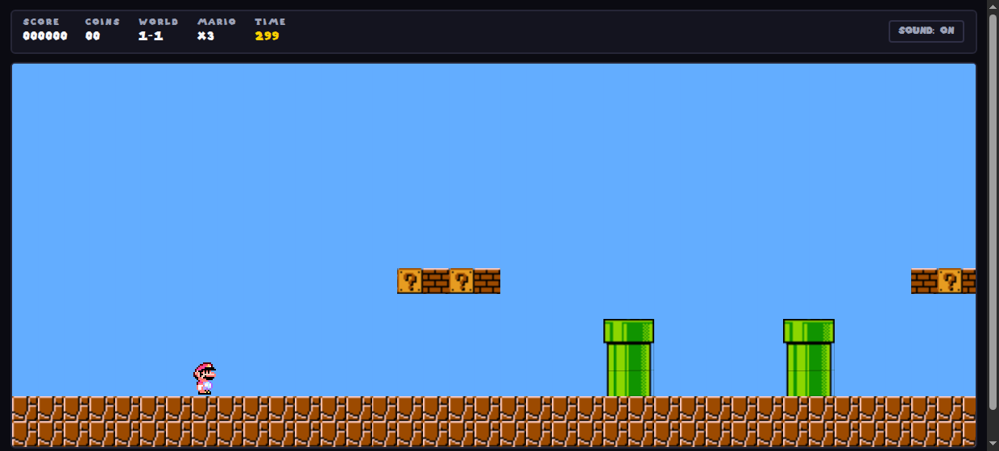

# Mario Platform Game

A side-scrolling platformer written in plain JavaScript, drawn on a single HTML
canvas. No framework, no bundler, no `npm install` — three script-less files and
a folder of sprites. Five levels, a flagpole at the end of each.



---

## Play it

**Locally** — the game needs to be served over HTTP (browsers refuse to load the
sprite sheet from a `file://` page), and any static server will do:

```bash
git clone https://github.com/AdarshGaur/Mario-Platform-Game.git
cd Mario-Platform-Game
python3 -m http.server 8000        # or: npx serve .
```

Then open <http://localhost:8000>. There is nothing to build.

**Deep links** — `index.html#1-3` starts that level directly, and the URL updates
as you progress, so a refresh drops you back where you were.

### Controls

| Action | Keys |
| --- | --- |
| Move | `←` `→` or `A` `D` |
| Jump | `↑`, `W` or `Space` |
| Pause | `P` or `Esc` |
| Restart the level (costs a life) | `R` |
| Mute | `M` |

On a phone or tablet an on-screen pad appears under the canvas.

### Scoring

| | Points |
| --- | --- |
| Bumping a coin block from below | 100 |
| Clearing a level | 1000 |
| Each unit left on the clock | 10 |

You get three lives. Falling into a pit or running the clock out costs one and
restarts the level; losing the last one ends the run. Progress (levels unlocked,
best score, mute) is kept in `localStorage`.

---

## The levels

| | Name | Width | Coin blocks | What it is |
| --- | --- | --- | --- | --- |
| 1-1 | Overworld | 130 tiles | 13 | The original level: pipes, brick rows, a stone staircase. |
| 1-2 | Pipe Valley | 150 tiles | 15 | A forest of pipes with three holes in the ground. |
| 1-3 | Sky Steps | 160 tiles | 12 | Two long chasms crossed on floating stone steps. |
| 1-4 | Brick Fortress | 170 tiles | 15 | Low brick ceilings, stair pyramids, climbing platforms. |
| 1-5 | The Long Run | 200 tiles | 24 | Everything at once, twice as long. |

---

## How it works

```
index.html          markup: HUD, canvas, overlay, touch pad
css/style.css       everything around the canvas (the game itself is all canvas)
js/levels.js        level data as character art, plus the decoder
js/game.js          the engine: loop, physics, collision, camera, screens
img/                spritesheet.png (tiles), mario-sprites.png, flag, logo, menu bg
audio/              music and four sound effects
tools/              a level checker and a playtest bot (both optional, Python)
```

### The loop

`requestAnimationFrame` drives `step()` then `render()`. `step()` reads the held
keys, integrates the player, resolves collisions, and checks the two end
conditions (touched the flagpole / fell below the world). `render()` clamps the
camera, paints the sky as a repeating pattern, and draws only the tile columns
that are actually on screen — a 200-tile level costs the same per frame as a
short one.

### Levels are character art

A level is 15 rows of text, one character per 32×32 tile:

```
.  sky            =  stone stair block      <> pipe mouth
#  ground         |  flagpole               [] pipe body
?  coin block     F  flag
b  brick          x  spent coin block
```

`decodeLevel()` in `js/levels.js` turns the rows into a flat `Uint8Array` and
records the level's size and where the flagpole is. Everything else — camera
limits, the win position, the length of the level — falls out of the data, so
adding a level is adding an entry to the `LEVELS` array.

### Physics and collision

Four numbers define the feel, and they are unchanged from the original
single-level version of this game:

```js
GRAVITY = 1        // px/frame², added every frame
FRICTION = 0.9     // both axes, applied after the move
ACCEL = 0.5        // px/frame² while a direction is held
JUMP_IMPULSE = 25  // one-shot upward kick
```

Friction on the horizontal axis caps the run at **4.5 px/frame**; the impulse and
gravity give an apex of **124 px** and a full-speed running jump that covers
**160 px**. Those three numbers are what every level is designed around — see
the envelope below.

The player's collision box is 32×32 sitting at the bottom of the 50px sprite.
Collisions are resolved **vertically first, then horizontally**, and the order is
load-bearing: gravity pushes the player a pixel into the floor every frame, so
resolving sideways first sees the floor as a wall the box is already touching and
refuses to let him walk at all. Landing snaps the feet to the top of the tile
below; a head that rises into a block is pushed back out, and if that block was a
coin block it becomes a spent block and pays 100 points; only then is the box in
the right place to ask what is beside it, which is resolved by undoing the move.

### Adding a level

1. Add an entry to `LEVELS` in `js/levels.js` — 15 rows, all the same width, a
   `|` flagpole column with an `F` beside its top.
2. Stay inside the design envelope. It is not a style guide, it is arithmetic:

   * The player climbs **at most 3 tiles**. A 4-tile wall or pipe is an
     impassable barrier — it misses by two pixels.
   * A 3-tile climb only works if the gap in front of it is **≤ 2 tiles**.
   * A flat gap can be **4 tiles at most**, and only with a tile or two of
     run-up; 3 is the comfortable maximum.
   * A coin block is only bumpable **4–5 rows above the floor you stand on**.
   * Leave **2 empty rows** above anything you expect the player to stand on,
     or he cannot fit there.
3. Check it:

   ```bash
   python3 tools/check_levels.py            # all levels, about a second
   python3 tools/check_levels.py 1-3        # just one
   ```

   The checker is a frame-for-frame copy of the engine's physics run over the
   level data: from the spawn it searches forward through every reachable
   player state — position, velocity, feet on the ground or not — choosing each
   frame between running, running and jumping, and coasting. If nothing ever
   crosses the flagpole it tells you where the run dries up. It also prints
   advisory notes about the shapes that have broken this game before (holes
   wider than four tiles, ceilings low enough to cut a jump short); those are
   hints, not failures, and can over-report.

   ```
   1-3  15 rows x 160 cols   coins  12   states   9652   finishable   OK
   ```

4. Optionally have a bot play it for real, in a browser:

   ```bash
   python3 -m http.server 8877 &
   python3 tools/playtest.py 1-3
   ```

   It drives headless Chromium over the DevTools protocol, holds *right*, and
   jumps at walls and holes. Needs `chromium` and `pip install websockets`. It
   is a crude player with no lookahead, so a level it fails is worth a look but
   is not necessarily broken — `check_levels.py` is the authority on whether a
   route exists at all.

---

## Deploying

The repository root *is* the site: static files, relative paths, no build step.
Every option below is free.

### GitHub Pages

`.github/workflows/deploy.yml` is already here. Push to `main`, then set
**Settings → Pages → Source** to **GitHub Actions** once. The site lands on
`https://<user>.github.io/Mario-Platform-Game/`; the relative paths mean the
sub-path is fine.

### Netlify

`netlify.toml` sets the publish directory and cache headers.

```bash
npx netlify-cli deploy --prod
```

Or connect the repository in the Netlify UI, leave the build command empty and
set the publish directory to `.`.

### Vercel

`vercel.json` does the same.

```bash
npx vercel --prod
```

Pick **Other** as the framework preset and leave the build command empty.

### Cloudflare Pages

Connect the repository, leave the build command empty and set the output
directory to `/`. No config file needed.

### Notes for any host

* Every path in `index.html` is relative, so the game works from a sub-path.
* Total payload is about **2 MB**, of which 1.7 MB is audio — the music is the
  single biggest file, and it streams rather than blocking the start.
* Browsers block audio until the first interaction, so the music starts on the
  click or key that starts a level. That is expected, not a bug.

---

## What changed from the original

The original version was one 500-line file with a single level, and the level
could not actually be finished: at column 47 a four-tile-tall pipe blocks the
way, and a running jump reaches 124px where 128px is needed. Past it, a ten-tile
pit had no crossing at all. It was only passable with the undocumented `U` key,
which added 10px/frame of speed.

* Level 1-1's two four-tile pipes are now three tiles, and the ten-tile pit has
  stepping stones. The rest of the layout is the original, tile for tile.
* One level became five, driven by data instead of a hard-coded 130-column map.
* Added: lives, a clock, a pause screen, a level picker with unlock progress,
  a score that persists, touch controls, deep links, and a mute toggle.
* Fixed: the head-bump check used a value computed once for the whole game, so
  only the first coin block ever behaved correctly; the background music was
  restarted on every frame; `window.close()` was called on a game over, which
  browsers ignore.
* The camera is clamped to the level instead of a hard-coded scroll limit, and
  drawing is culled to the visible columns.

Physics constants and the sprite coordinates are untouched, so it still moves
and looks like the original.

---

## Assets

The sprite sheets, font and sounds are Nintendo's, used here for a hobby
learning project. The code is MIT licensed (see `LICENSE`); the artwork and
audio are not mine to license, so treat this as a study piece rather than
something to ship commercially.
